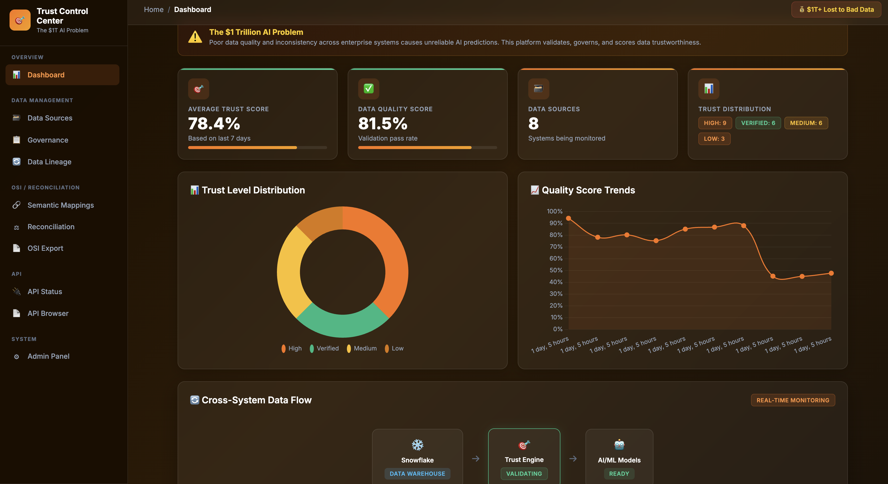
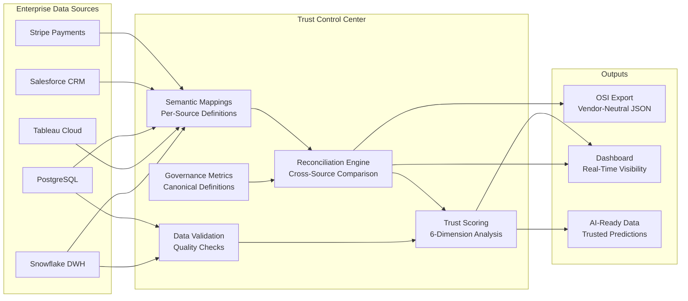
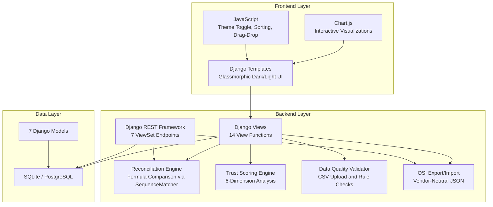
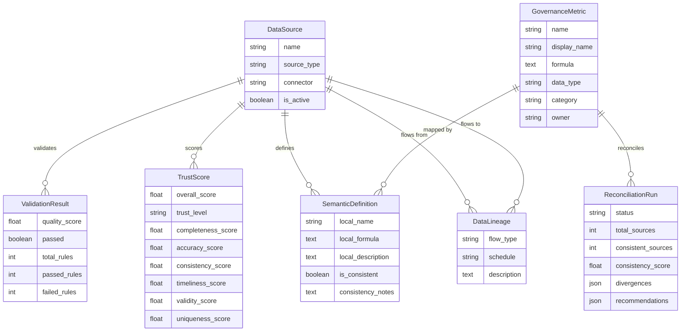
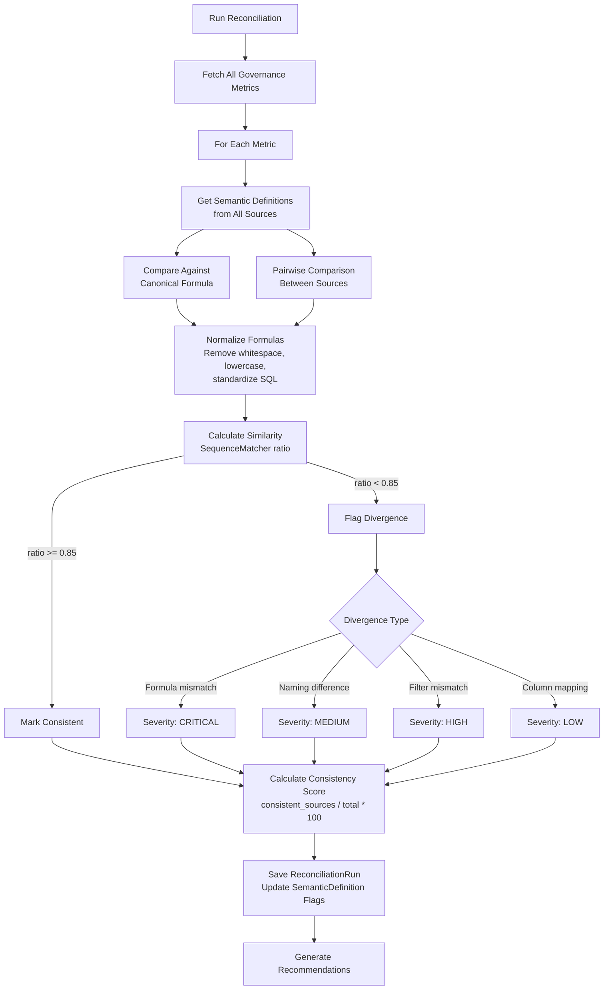
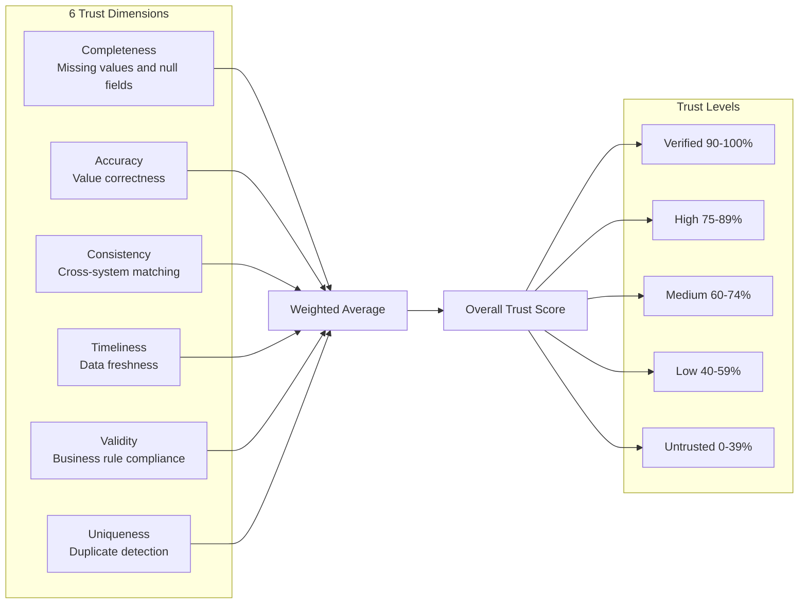

# Trust Control Center — The $1 Trillion AI Problem

> **When "revenue" means different things in Snowflake, Tableau, and Salesforce, every AI model trained on that data is wrong.**

A Django-based platform that detects, visualizes, and resolves cross-source metric inconsistencies — the root cause of unreliable AI predictions that costs enterprises over **$1 trillion annually**.

Built around the [Open Semantic Interchange (OSI)](https://venturebeat.com/ai/the-usd1-trillion-ai-problem-why-snowflake-tableau-and-blackrock-are-giving) initiative by Snowflake, Salesforce, dbt Labs, BlackRock, and 15+ other companies.

---

<div align="center">
  
</div>

---

## The Problem

Enterprise data is fragmented across dozens of systems. The same business metric — "revenue", "customer count", "churn rate" — is defined and calculated differently in each one:

| System | "Total Revenue" Formula | Issue |
| ------ | ---------------------- | ----- |
| Snowflake DWH | `SUM(amount) WHERE status = 'completed'` | Canonical definition |
| Tableau Cloud | `SUM(amount) WHERE status IN ('completed', 'pending')` | Includes pending — overstates by ~12% |
| PostgreSQL | `SUM(charge_amount) WHERE payment_status = 'succeeded'` | Uses net amount (excludes tax) |
| Salesforce CRM | `SUM(Opportunity.Amount) WHERE Stage = 'Closed Won'` | Opportunity-based, not payment-based |

When AI/ML models train on data with these silent inconsistencies, they produce unreliable predictions. Teams make decisions based on conflicting numbers. This is the **$1 Trillion AI Problem**.

---

## How It Works



---

## Architecture



---

## Data Model



---

## Reconciliation Flow



---

## Trust Scoring Dimensions



---

## Features

### Cross-Source Metric Reconciliation

- Define canonical governance metrics (the single source of truth)
- Map how each metric is implemented in every data source (semantic definitions)
- Run automated reconciliation to detect formula, naming, filter, and column mapping divergences
- Get severity-rated divergences with actionable recommendations

### Trust Scoring (6 Dimensions)

- **Completeness** — Missing values, null fields, required columns
- **Accuracy** — Outlier detection, value range validation
- **Consistency** — Cross-system matching, format standardization
- **Timeliness** — Data freshness, update frequency
- **Validity** — Business rule compliance, referential integrity
- **Uniqueness** — Duplicate row detection, key uniqueness

### Data Lineage Tracking

- Map data flows between enterprise systems (ETL, replication, streaming, API sync)
- Track which metrics flow through which pipelines
- Identify where inconsistencies are introduced in the data supply chain

### OSI-Compatible Export/Import

- Export your entire semantic model as vendor-neutral JSON
- Import OSI specs from other teams or tools
- Based on the Open Semantic Interchange standard by Snowflake, Salesforce, dbt Labs, BlackRock, and 15+ companies

### Data Quality Validation

- Upload CSV files for automated quality checks
- Null detection, type validation, range checks, uniqueness analysis
- Historical validation tracking per data source

### REST API

- Full CRUD API for all entities via Django REST Framework
- Browsable API at `/api/v1/`
- Endpoints: data sources, governance metrics, semantic definitions, reconciliations, lineage, trust scores, validations
- OSI export/import via API

---

## Pages

| Page | URL | Description |
| ---- | --- | ----------- |
| Dashboard | `/` | Overview with trust scores, quality trends, reconciliation status, dimension analysis |
| Data Sources | `/sources/` | All monitored systems with trust scores and validation history |
| Governance | `/governance/` | Define canonical metrics (the single source of truth) |
| Semantic Mappings | `/semantic/` | Map how metrics are implemented per source system |
| Reconciliation | `/reconciliation/` | Run cross-source comparison, view divergences |
| Data Lineage | `/lineage/` | Track data flows between systems |
| OSI Export | `/osi/` | Export/import semantic model as vendor-neutral JSON |
| API Browser | `/api/v1/` | Interactive REST API explorer |
| Admin Panel | `/admin/` | Django admin for direct data management |

---

## Quick Start

```bash
# Clone and setup
git clone https://github.com/somesh-ghaturle/1-Trillion-AI-Problem.git
cd 1-Trillion-AI-Problem
python -m venv .venv
source .venv/bin/activate
pip install -r requirements.txt

# Initialize database
python manage.py migrate

# Load sample data (8 sources, 8 metrics, 23 semantic definitions, reconciliation runs)
python manage.py seed_data

# Start the server
python manage.py runserver
```

Open <http://localhost:8000/> to see the dashboard populated with realistic enterprise data demonstrating cross-source inconsistencies.

### Sample Data

The `seed_data` command creates a realistic enterprise scenario:

- **8 data sources**: Snowflake DWH, Tableau Cloud, PostgreSQL Production, Salesforce CRM, Stripe Payments, HubSpot Marketing, Google BigQuery, CSV Uploads
- **8 governance metrics**: Total Revenue, MRR, Active Customer Count, Churn Rate, CAC, NPS, Average Deal Size, Pipeline Uptime
- **23 semantic definitions**: Showing how each metric is calculated differently in each system — with intentional inconsistencies that mirror real-world enterprise problems
- **9 data lineage flows**: ETL pipelines, streaming, API syncs, and manual uploads between systems
- **40 validation results**: Historical quality checks across all sources
- **24 trust scores**: 6-dimension trust analysis for all sources
- **8 reconciliation runs**: Automated cross-source comparison results

To reset and re-seed:

```bash
python manage.py seed_data --flush
```

---

## Docker

```bash
# Build and run
docker-compose up --build

# Or standalone
docker build -t trust-control-center .
docker run -p 8000:8000 trust-control-center
```

---

## API Endpoints

| Endpoint | Methods | Description |
| -------- | ------- | ----------- |
| `/api/` | GET | API health check |
| `/api/v1/sources/` | GET, POST, PUT, DELETE | Data source CRUD |
| `/api/v1/governance-metrics/` | GET, POST, PUT, DELETE | Governance metric CRUD |
| `/api/v1/semantic-definitions/` | GET, POST, PUT, DELETE | Semantic definition CRUD |
| `/api/v1/reconciliations/` | GET | Reconciliation run history |
| `/api/v1/reconciliations/run/` | POST | Trigger reconciliation |
| `/api/v1/lineage/` | GET, POST, PUT, DELETE | Data lineage CRUD |
| `/api/v1/trust-scores/` | GET | Trust score history |
| `/api/v1/validations/` | GET | Validation result history |
| `/api/v1/governance-metrics/osi-export/` | GET | OSI spec export |
| `/api/v1/governance-metrics/osi-import/` | POST | OSI spec import |

---

## Management Commands

```bash
# Populate realistic sample data
python manage.py seed_data

# Reset and re-populate
python manage.py seed_data --flush

# Calculate trust scores for all sources
python manage.py calc_trust

# Run data validation
python manage.py validate_data --file path/to/data.csv --source "my-source"

# Export governance metrics
python manage.py export_governance
```

---

## Tests

```bash
# Run all 54 tests
python manage.py test core -v 2

# Run specific test modules
python manage.py test core.tests.test_reconciliation -v 2
python manage.py test core.tests.test_api -v 2
python manage.py test core.tests.test_models -v 2
python manage.py test core.tests.test_views -v 2
```

Test coverage includes:

- Model creation and constraints (unique_together, validators)
- All 14 view functions (GET and POST)
- All REST API endpoints (CRUD operations)
- Reconciliation engine (consistent, divergent, naming, formula detection)
- OSI export/import round-trip
- Trust score calculation

---

## Project Structure

```text
./
├── trustsite/                  # Django project settings
│   ├── settings.py             # Configuration (DRF, CORS, WhiteNoise, security)
│   ├── urls.py                 # Root URL configuration
│   └── wsgi.py
├── core/                       # Main application
│   ├── models.py               # 7 models (DataSource, GovernanceMetric, SemanticDefinition, etc.)
│   ├── views.py                # 14 view functions
│   ├── api_views.py            # DRF ViewSets (7 endpoints)
│   ├── serializers.py          # DRF serializers
│   ├── urls.py                 # URL routing + DRF router
│   ├── admin.py                # Django admin configuration
│   ├── utils/
│   │   ├── reconciliation.py   # Cross-source reconciliation engine
│   │   ├── osi_export.py       # OSI-compatible JSON export/import
│   │   ├── trust_scoring.py    # 6-dimension trust scoring engine
│   │   ├── data_quality_validator.py  # CSV quality validation
│   │   └── data_governance.py  # Governance utilities
│   ├── management/commands/
│   │   ├── seed_data.py        # Populate realistic sample data
│   │   ├── calc_trust.py       # Batch trust score calculation
│   │   ├── validate_data.py    # CLI data validation
│   │   └── export_governance.py
│   └── tests/
│       ├── test_models.py      # Model tests
│       ├── test_views.py       # View tests
│       ├── test_api.py         # API endpoint tests
│       └── test_reconciliation.py  # Reconciliation, OSI, semantic tests
├── templates/                  # Django templates (glassmorphic dark/light UI)
│   ├── base.html               # Sidebar layout, theme toggle
│   ├── dashboard.html          # Main dashboard with Chart.js
│   ├── data_sources.html       # Source list with trust badges
│   ├── governance_metrics.html # Metric definitions
│   ├── semantic_definitions.html # Per-source mappings
│   ├── reconciliation.html     # Cross-source comparison
│   ├── lineage.html            # Data flow visualization
│   └── osi_export.html         # OSI JSON export/import
├── static/
│   ├── css/main.css            # CSS with dark/light theme variables
│   └── js/main.js              # Theme toggle, sortable tables, drag-drop
├── Dockerfile                  # Python 3.11-slim with Gunicorn
├── docker-compose.yml
├── requirements.txt            # Django, DRF, CORS, WhiteNoise, Gunicorn, pandas
├── .github/workflows/ci.yml   # GitHub Actions CI (Python 3.11/3.12 matrix)
└── README.md
```

---

## Tech Stack

- **Backend**: Django 4.2+, Django REST Framework
- **Frontend**: Django Templates, Chart.js, CSS Variables (dark/light theming)
- **Database**: SQLite (dev), PostgreSQL (prod)
- **Static Files**: WhiteNoise
- **CORS**: django-cors-headers
- **Containerization**: Docker, Gunicorn
- **CI/CD**: GitHub Actions (Python 3.11/3.12 matrix, Django tests, Docker build)

---

## Background: The OSI Initiative

The **Open Semantic Interchange (OSI)** is a vendor-neutral specification created by Snowflake, Salesforce, dbt Labs, BlackRock, and 15+ other companies. It standardizes how semantic metadata (metrics, dimensions, relationships) is defined and shared across tools — a "Rosetta Stone" for business data.

This project implements the core principles of OSI:

1. **Canonical metric definitions** — One authoritative formula per business metric
2. **Semantic mappings** — How each source system implements each metric
3. **Cross-source reconciliation** — Automated detection of where definitions diverge
4. **Vendor-neutral interchange** — Export/import semantic models as JSON

Learn more: [VentureBeat — The $1 Trillion AI Problem](https://venturebeat.com/ai/the-usd1-trillion-ai-problem-why-snowflake-tableau-and-blackrock-are-giving)

---

## Roadmap

### Phase 1 — Security & API Polish
- [ ] **Authentication & Role-Based Access Control** — User login, admin/viewer roles, token-based API auth, permission scoping per endpoint
- [ ] **Swagger/OpenAPI Documentation** — Interactive API docs at `/api/docs/` using `drf-spectacular`, auto-generated schema from serializers
- [ ] **API Rate Limiting & Throttling** — DRF throttling classes for public and authenticated endpoints

### Phase 2 — Production Infrastructure
- [ ] **PostgreSQL Support** — Production-grade database with `docker-compose.yml` running Postgres + Django
- [ ] **Celery + Redis for Async Tasks** — Background job processing for reconciliation runs, trust score calculations, and bulk operations
- [ ] **Real-Time Alerts & Notifications** — Webhook and email alerts when trust scores drop, reconciliation detects divergences, or validation fails

### Phase 3 — Analytics & Export
- [ ] **Historical Trend Analytics** — Track trust score changes over time, anomaly detection on quality metrics, trend forecasting
- [ ] **CSV / Excel / Parquet Export** — Export reconciliation results, trust scores, and governance metrics in multiple formats beyond JSON/OSI
- [ ] **Bulk Import & Batch Operations** — Batch upload of semantic definitions, bulk reconciliation across all metrics

### Phase 4 — UX & Usability
- [ ] **Advanced Search & Filtering** — Full-text search across metrics, sources, and definitions; filter by trust level, divergence severity, source type
- [ ] **Real Data Source Connectors** — Live integrations with Snowflake, Tableau, Salesforce, BigQuery, and dbt for automatic semantic definition sync
- [ ] **Monitoring & Observability Dashboard** — Prometheus metrics, health checks, uptime tracking, and integration with Grafana

---

## Contributing

PRs welcome. For changes to scoring logic, reconciliation rules, or governance features, include unit tests in `core/tests/`.

```bash
# Run tests before submitting
python manage.py test core -v 2
```

---

## License

Open source. See repository for details.
