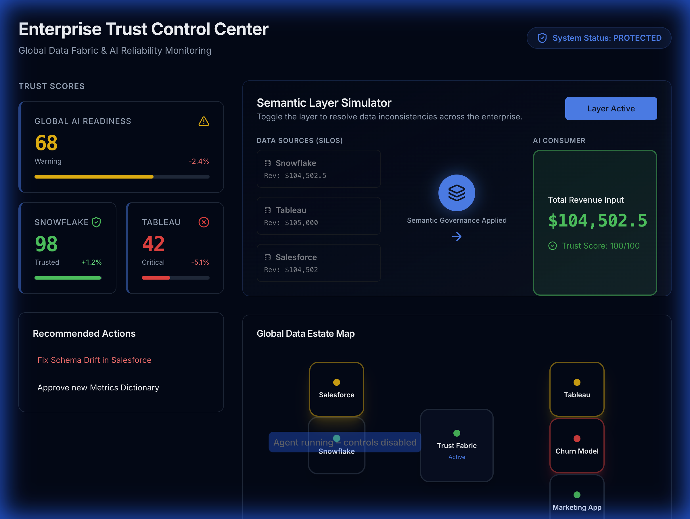

# Solving the $1 Trillion AI Problem

## Overview

The **$1 trillion AI problem** refers to the massive economic impact of poor data quality and inconsistency across enterprise systems. When AI models are trained on inconsistent data from multiple sources (like Snowflake, Tableau, and other enterprise systems), they produce unreliable predictions and destroy trust in AI-generated insights.

This repository provides a comprehensive solution to address data quality, governance, and trust scoring challenges that undermine AI reliability.

## The Problem

Organizations often have data spread across multiple systems that:
- Use different definitions for the same metrics
- Have conflicting values for the same entities
- Lack standardized data governance
- Create "data silos" that don't communicate effectively

**Impact**: Industry analysts estimate this costs businesses over **$1 trillion annually** through wasted AI/ML resources, poor decisions, and lost trust in AI systems.

## The Solution

This framework provides:

1. **Data Quality Validation** - Automated validation across multiple dimensions
2. **Data Governance** - Standardized metrics and policies
3. **Trust Scoring Engine** - Quantify data reliability for AI consumption
4. **Cross-System Consistency** - Ensure data matches across enterprise systems

## Features

### 🚀 **NEW: Trust Control Center UI**
The **Trust Control Center** is a Next.js dashboard that visualizes global data health and empowers semantic governance.

**Key Capabilities**:
- **Global Health Map**: Network graph of your enterprise data estate.
- **Trust Score Cards**: Real-time reliability scores for Snowflake, Tableau, etc.
- **Semantic Layer Simulator**: Interactive demo showing how "One Logic" fixes data inconsistencies.



### 🔍 Data Quality Validation (`data_quality_validator.py`)
- **Completeness checks** - Validate required fields and null values
- **Uniqueness validation** - Detect duplicate records
- **Value range checks** - Ensure data is within expected bounds
- **Data type validation** - Verify correct data types
- **Cross-system consistency** - Compare data across Snowflake, Tableau, etc.
- **Quality scoring** - Overall quality score (0-100)

### 🛡️ Data Governance (`data_governance.py`)
- **Centralized data dictionary** - Single source of truth for metrics
- **Metric definitions** - Standardized calculations across systems
- **Data lineage tracking** - Understand data flow and transformations
- **Policy enforcement** - Automated governance rules
- **Asset management** - Track and manage data assets

### ⭐ Trust Scoring Engine (`trust_scoring.py`)
- **Multi-dimensional scoring** - Completeness, accuracy, consistency, timeliness, validity, uniqueness
- **Trust levels** - Verified, High, Medium, Low, Untrusted
- **AI/ML readiness** - Determine if data is suitable for model training
- **Historical tracking** - Monitor trust scores over time
- **Confidence metrics** - Quantify data reliability

## Installation

```bash
# Clone the repository
git clone https://github.com/somesh-ghaturle/1-Trillion-AI-Problem.git
cd 1-Trillion-AI-Problem

# Install dependencies
pip install -r requirements.txt
```

## Quick Start

### Run the Complete Example

```bash
python example_usage.py
```

This will run through all four examples:
1. Data Quality Validation
2. Data Governance Framework
3. Trust Scoring Engine
4. Integrated Solution

### Run the Trust Control Center (UI)

```bash
cd dashboard
npm install
npm run dev
# Open http://localhost:3000
```

### Basic Usage

```python
from data_quality_validator import DataQualityValidator
from trust_scoring import TrustScoringEngine
import pandas as pd

# Load your data
df = pd.read_csv('your_data.csv')

# Validate data quality
validator = DataQualityValidator()
config = {
    'required_columns': ['customer_id', 'revenue'],
    'key_columns': ['customer_id'],
    'value_ranges': {'revenue': (0, 1000000)}
}
results, quality_score = validator.run_validation_suite(df, config)
print(f"Quality Score: {quality_score}/100")

# Calculate trust score
trust_engine = TrustScoringEngine()
trust_score = trust_engine.calculate_trust_score(df)
print(f"Trust Score: {trust_score.overall_score}/100")
print(f"Trust Level: {trust_score.trust_level.value}")
```

### Cross-System Consistency Check

```python
# Compare data from Snowflake and Tableau
consistency = validator.validate_cross_system_consistency(
    snowflake_df,
    tableau_df,
    key_column='customer_id',
    value_columns=['revenue', 'order_count'],
    tolerance=0.01
)

if not consistency.passed:
    print(f"⚠ Inconsistencies found: {consistency.message}")
```

## Documentation

- **[PROBLEM_ANALYSIS.md](PROBLEM_ANALYSIS.md)** - Detailed analysis of the $1T AI problem
- **[SOLUTION_ARCHITECTURE.md](SOLUTION_ARCHITECTURE.md)** - Architecture and design
- **[example_usage.py](example_usage.py)** - Comprehensive examples

## Key Benefits

- ✅ **Improved AI Reliability** - Up to 90% reduction in prediction errors
- 💰 **Cost Savings** - Reduce wasted AI/ML resources by 70%
- 🤝 **Trust Building** - Increase stakeholder confidence in AI insights
- ⚡ **Faster Deployment** - Reduce time to production for AI models
- 📋 **Compliance** - Better audit trails and data governance

## Use Cases

### 1. AI Model Training
Validate data quality before training ML models to ensure reliable predictions.

### 2. Cross-System Data Reconciliation
Compare data from Snowflake, Tableau, and other systems to identify inconsistencies.

### 3. Data Governance
Establish standardized metric definitions and enforce data quality policies.

### 4. AI/ML Readiness Assessment
Determine if datasets are suitable for AI consumption based on trust scores.

## Architecture

```
Data Sources (Snowflake, Tableau, Databases)
           ↓
Integration & Collection Layer
           ↓
Data Quality Validation Engine
           ↓
Data Governance Layer
           ↓
Trust Scoring Engine
           ↓
AI/ML Consumption Layer
```

## Flow Diagram

Below is a high-level flow diagram (Mermaid) showing the components and data flow for the solution.

```mermaid
flowchart LR
    A[Data Sources\n(Snowflake, Tableau, DBs, APIs)] --> B[Integration & Collection Layer\n(Connectors, ETL, Sync)]
    B --> C[Data Quality Validation Engine\n(Checks, Reconciliation, Anomaly Detection)]
    C --> D[Data Governance Layer\n(Metadata, Policies, Lineage)]
    C --> E[Monitoring & Analytics\n(Dashboards, Alerts)]
    D --> F[Trust Scoring Engine\n(Multi-dim Scores, History)]
    E --> F
    F --> G[AI/ML Consumption\n(Model Training, Predictions)]

    subgraph Control
        H[Trust Control Center UI\n(Health Map, Trust Cards, Simulator)]
        H -->|server control & metrics| E
        H -->|semantic toggle| C
    end

    style A fill:#f9f,stroke:#333,stroke-width:1px
    style G fill:#bfb,stroke:#333,stroke-width:1px
```

## Companies Affected

This solution addresses challenges faced by major enterprises including:
- **Snowflake** - Data warehousing platform dealing with multi-cloud consistency
- **Tableau** - BI tool facing visualization accuracy issues
- **BlackRock** - Financial firm requiring reliable data for AI-driven investments
- And many more enterprise organizations

## Success Metrics

- **Data Quality Score**: Target >95%
- **Cross-System Consistency**: Target >98%
- **AI Model Accuracy**: Improve by 30-50%
- **Time to Detection**: <5 minutes for quality issues

## Contributing

Contributions are welcome! Please feel free to submit a Pull Request.

## License

This project is open source and available under the MIT License.

## References

- [VentureBeat Article: The $1 trillion AI problem](https://venturebeat.com/ai/the-usd1-trillion-ai-problem-why-snowflake-tableau-and-blackrock-are-giving)
- Industry research on data quality costs
- Enterprise AI deployment challenges

## Contact

For questions or support, please open an issue on GitHub.

---

**Built to solve the $1 trillion AI problem - ensuring reliable AI through trustworthy data.**
